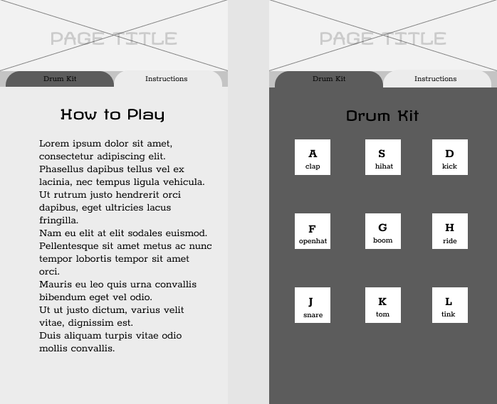
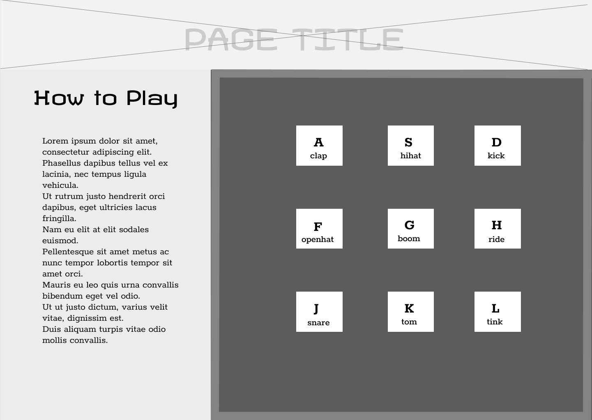

# Drum Kit

#### Media scaling drum emulator

### By: Chynna Lew

## Technologies
* Javascript
* HTML
* CSS / Bootstrap

## Description
This application was created to practice basic JS and transforming Figma wireframing to HTML/CSS. The desktop site contains a single page showing both the drumkit and the instructions. The mobile site contains two tabs to toggle between the instructions and the drum kit. Please view the diagrams below

## Setup / instructions
* download or clone (this)[https://github.com/chynnalew/drum-kit] repository
* open index.html in your local browser

## Diagrams/Mock-up

Mobile

Desktop

## Known Bugs
* no bugs known at this time

## License

[MIT](https://opensource.org/licenses/MIT)

### Contact

Chynna Lew